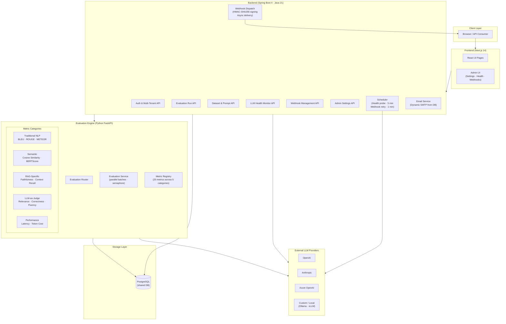
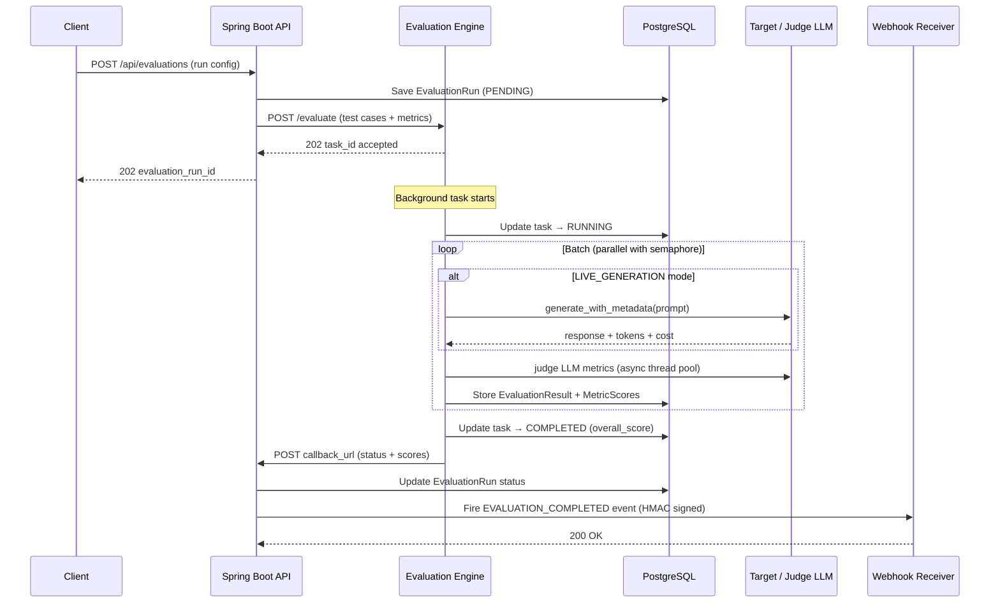
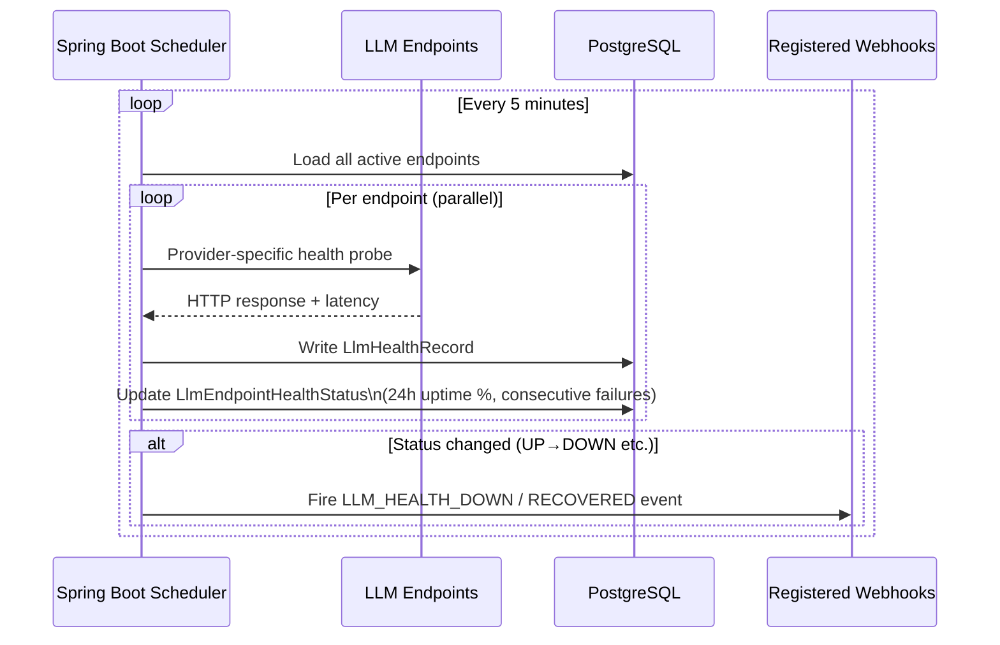

# LLMOps Eval — Architecture Overview

## System Architecture



---

## Request Flow: Evaluation Run



---

## LLM Health Monitoring Flow



---

## Component Architecture

```
┌────────────────────────────────────────────────────────────────────────┐
│                        LLMOps Eval Platform                            │
│                                                                        │
│  ┌─────────────────────────────────────────────────────────────────┐   │
│  │                    Next.js 14 Frontend                          │   │
│  │  /dashboard  /evaluations  /datasets  /llm-endpoints            │   │
│  │  /admin/settings  /admin/health  /admin/webhooks                │   │
│  └─────────────────┬───────────────────────────────────────────────┘   │
│                    │ REST / JSON                                        │
│  ┌─────────────────▼───────────────────────────────────────────────┐   │
│  │                Spring Boot 4 Backend (Port 8080)                │   │
│  │                                                                 │   │
│  │  ┌──────────────┐  ┌──────────────┐  ┌──────────────────────┐  │   │
│  │  │  Auth + RBAC │  │  Evaluation  │  │  LLM Health Monitor  │  │   │
│  │  │  Multi-tenant│  │  Run Manager │  │  Scheduler + Probes  │  │   │
│  │  └──────────────┘  └──────┬───────┘  └──────────────────────┘  │   │
│  │                           │                                     │   │
│  │  ┌──────────────┐  ┌──────▼───────┐  ┌──────────────────────┐  │   │
│  │  │  Dataset /   │  │  Webhook     │  │  Admin Settings      │  │   │
│  │  │  Prompt Mgmt │  │  Dispatch    │  │  Dynamic SMTP Config │  │   │
│  │  └──────────────┘  └──────────────┘  └──────────────────────┘  │   │
│  │                                                                 │   │
│  │  ┌──────────────────────────────────────────────────────────┐   │   │
│  │  │              PostgreSQL (Flyway migrations)               │   │   │
│  │  └──────────────────────────────────────────────────────────┘   │   │
│  └─────────────────┬───────────────────────────────────────────────┘   │
│                    │ HTTP (internal)                                    │
│  ┌─────────────────▼───────────────────────────────────────────────┐   │
│  │          Python FastAPI Evaluation Engine (Port 8000)           │   │
│  │                                                                 │   │
│  │  ┌──────────────────────────────────────────────────────────┐   │   │
│  │  │                    Metric Registry                       │   │   │
│  │  │  Traditional NLP │ Semantic │ RAG │ Judge │ Performance  │   │   │
│  │  └──────────────────────────────────────────────────────────┘   │   │
│  │                                                                 │   │
│  │  asyncio.gather() parallel batches · semaphore concurrency     │   │
│  │  asyncio.to_thread() for sync LLM SDK calls                    │   │
│  └─────────────────────────────────────────────────────────────────┘   │
└────────────────────────────────────────────────────────────────────────┘
```

---

## How LLMOps Eval Differs from Other Tools

```
┌────────────────────────────────────────────────────────────────────────────────┐
│                     Competitive Differentiation Matrix                         │
├──────────────────────┬─────────────┬───────────────┬────────────┬─────────────┤
│ Feature              │ LLMOps Eval │  LangSmith    │ PromptLayer│   W&B Weave │
├──────────────────────┼─────────────┼───────────────┼────────────┼─────────────┤
│ Fully self-hosted    │      ✅      │  ❌ Cloud only │  ❌ Cloud  │ Partial     │
│ Open source (MIT)    │      ✅      │  ❌ Proprietary│  ❌        │ ❌          │
│ 25 built-in metrics  │      ✅      │  Custom only  │  Limited   │ Custom only │
│ LLM Health Monitor   │      ✅      │  ❌            │  ❌        │  ❌         │
│ Webhook system       │      ✅      │  ❌            │  ❌        │  ❌         │
│ Multi-tenant org/proj│      ✅      │  Workspace    │  Limited   │  Teams      │
│ Dynamic email config │      ✅      │  ❌            │  ❌        │  ❌         │
│ K8s-ready (Kustomize)│      ✅      │  N/A          │  N/A       │  N/A        │
│ RAG-specific metrics │      ✅      │  Partial      │  ❌        │  Partial    │
│ BERTScore built-in   │      ✅      │  ❌            │  ❌        │  ❌         │
│ LIVE_GENERATION mode │      ✅      │  ✅            │  ✅        │  ✅         │
│ Async batch parallel │      ✅      │  N/A          │  N/A       │  N/A        │
│ No per-seat pricing  │      ✅      │  ❌            │  ❌        │  ❌         │
└──────────────────────┴─────────────┴───────────────┴────────────┴─────────────┘
```

### Key Differentiators in Detail

**1. Self-Hosted + Open Source**
LangSmith, PromptLayer, and W&B Weave are SaaS products that send your prompts and outputs to their cloud. LLMOps Eval runs entirely in your infrastructure — critical for regulated industries (healthcare, finance, government) where data cannot leave the perimeter.

**2. Built-in LLM Health Monitoring**
No other evaluation platform includes an active health monitoring layer that probes LLM endpoints every 5 minutes, tracks 24-hour uptime percentages, detects degradation, and fires webhooks on status changes. This turns the platform from a passive evaluation tool into an operational observability layer.

**3. 25 Metrics Out of the Box**
| Category | Metrics |
|---|---|
| Traditional NLP | BLEU, ROUGE-1/2/L, METEOR, CER, WER |
| Semantic | Cosine Similarity (sentence-transformers), BERTScore |
| RAG-Specific | Faithfulness, Context Precision, Context Recall, Answer Relevance |
| LLM-as-Judge | Relevance, Coherence, Fluency, Toxicity, Answer Correctness, Custom |
| Performance | Latency, Token count, Cost estimation |

**4. Webhook System with HMAC Signing**
12 event types with HMAC-SHA256 signature verification — enabling integrations with Slack, PagerDuty, CI/CD pipelines, or any HTTP endpoint. Automatic retry with exponential backoff, auto-disable after 10 consecutive failures.

**5. Multi-Tenant with Dynamic Admin Config**
Organizations can configure their own SMTP servers, platform branding, and webhook endpoints through the UI — no server restart required. Built for MSPs and SaaS builders who serve multiple customers from one deployment.
